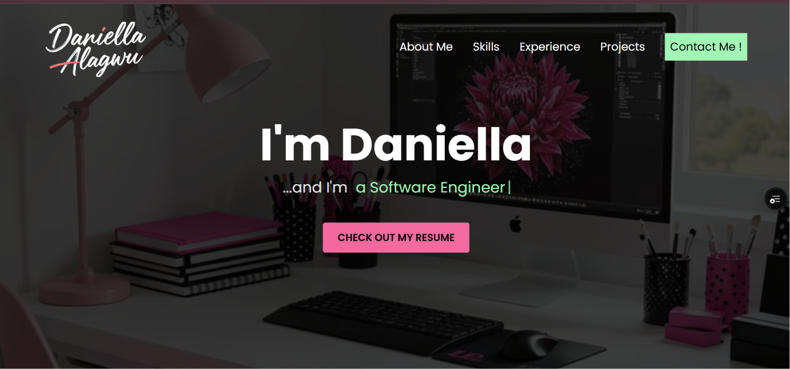
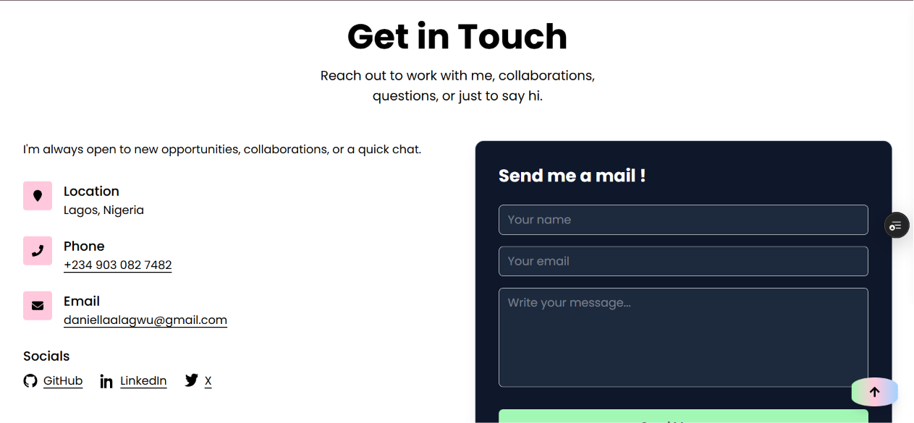

# Personal Portfolio - Software Engineer


A modern developer portfolio built with **Next.js**, showcasing my skills, projects, and contact form powered by **EmailJS**.

## DEMO
[](https://daniella-alagwu.vercel.app/)


## FEATURES
- Responsive design with Tailwind CSS
- Animated typewriter intro
- Contact form with EmailJS integration
- Resume download link
- Deployed live on Vercel

## LIVE DEMO 
 [View Portfolio on Vercel](https://daniella-alagwu.vercel.app/)


## REQUIREMENTS
- Node.js v18+
- npm or yarn
- EmailJS account (with Service ID, Template ID, and Public Key)


## INSTALLATION
Clone the repo and install dependencies:

```bash
git clone https://github.com/mimi-daniella/portfolio.git
cd my-portfolio
npm install
```

## USAGE 

```bash
npm run dev
```
Open https://localhost:3000 in your browser 

## CONFIGURATIONS
- Create .env.local file in the root directory and add:
NEXT_PUBLIC_EMAILJS_SERVICE_ID=your_service_id
NEXT_PUBLIC_EMAILJS_TEMPLATE_ID=your_template_id
NEXT_PUBLIC_EMAILJS_PUBLIC_KEY=your_public_key


